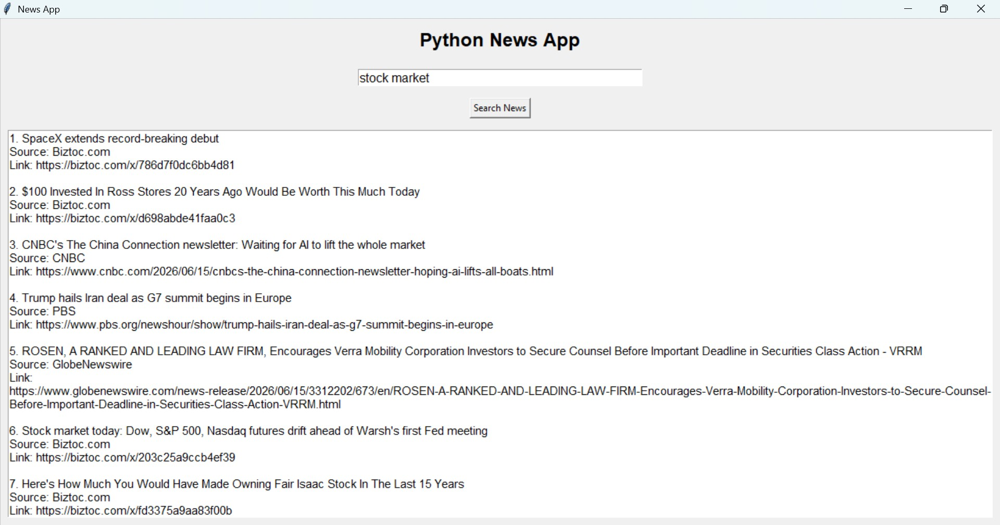

# 📰 GUI News App

A Python Tkinter-based desktop application that fetches and displays the latest news headlines using a News API. The application provides a clean and user-friendly interface for reading current news updates in real time.

## 📸 Screenshot



## 🚀 Features

- Fetch latest news headlines
- Simple and attractive GUI
- Real-time news updates
- Easy navigation through articles
- Error handling for network issues
- Fast and lightweight application

## 🛠️ Technologies Used

- Python
- Tkinter
- Requests
- News API
- JSON

## 📦 Installation

1. Clone the repository

```bash
git clone https://github.com/subratlabs/gui-news-app.git
```

2. Install dependencies

```bash
pip install requests
```

3. Run the application

```bash
python news_app.py
```

## 🎯 Learning Outcomes

This project helped me learn:

- API Integration
- GUI Development with Tkinter
- Working with JSON Data
- HTTP Requests
- Error Handling
- Building Real-World Applications

## 📂 Project Structure

```text
news_app.py
README.md
screenshot.png
```

## 👨‍💻 Author

Subrat Dubey

GitHub: https://github.com/subratlabs
